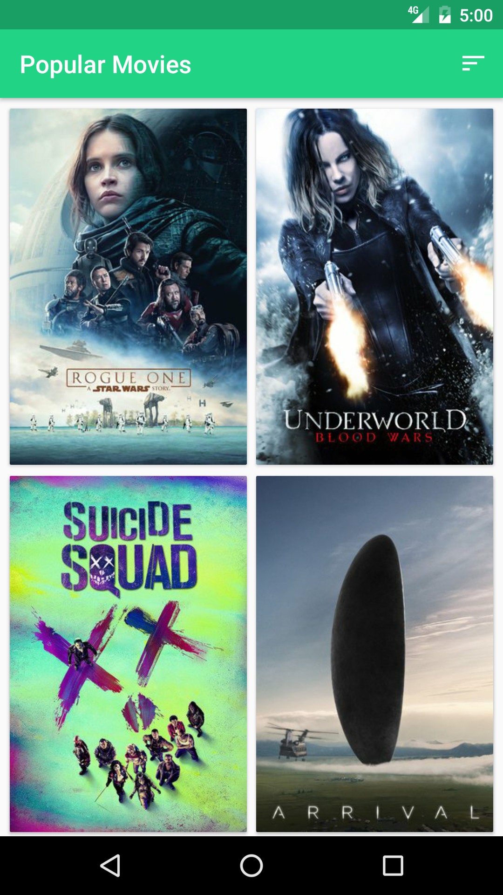
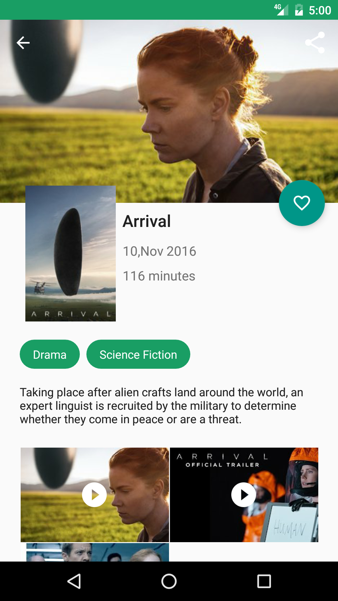
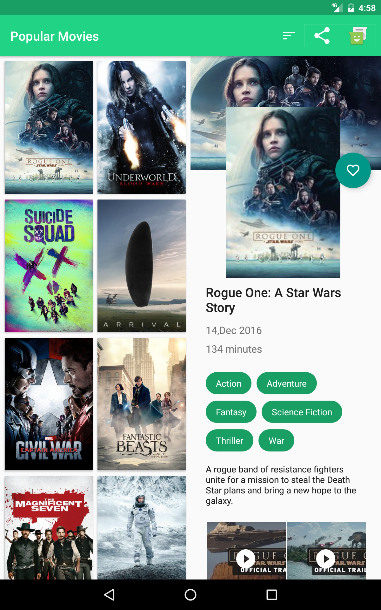
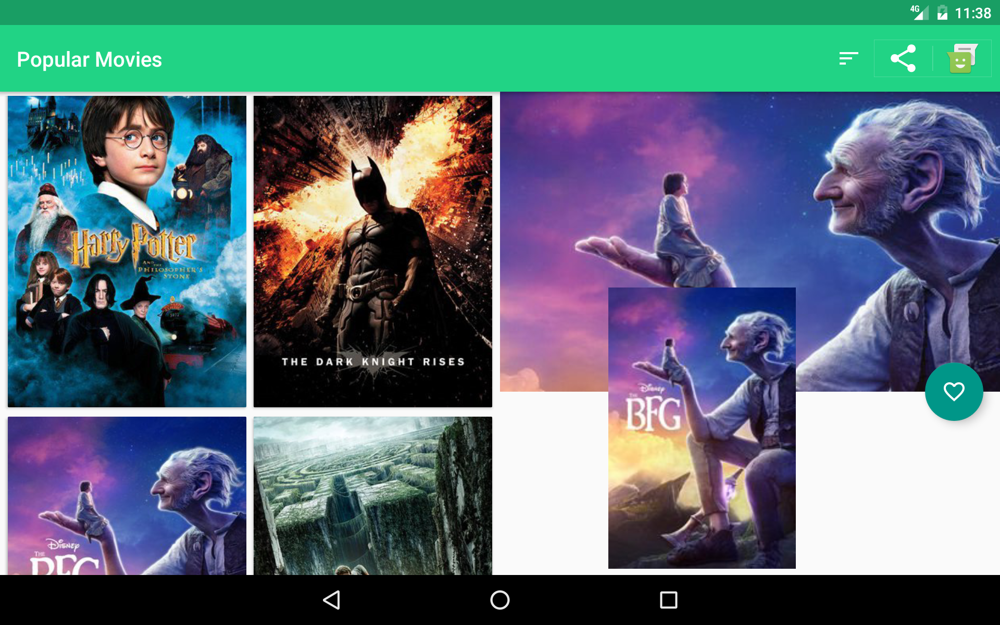

# Project-2-PopularMovies
This is the second project developed as part of Udacity's Android Developer Nanodegree.

### Getting Started
App uses themoviedb.org API. Register at https://www.themoviedb.org/account/signup?language=en-EN to create your own API key. Paste your API key at 
	<string name="api_key"></string> in strings.xml
